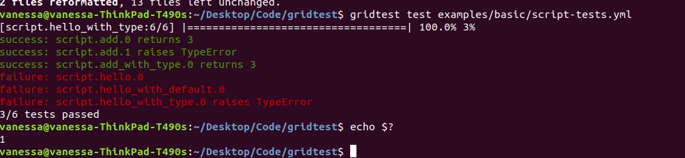
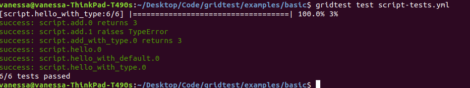

# Basic Example

This basic example will show how to generate and run a grid test.

## Install

After you've installed gridtest:

```bash
git clone git@github.com:vsoch/gridtest
cd gridtest
pip install -e .
```

or

```bash
pip install gridtest
```

## Generate

then you can cd into this folder, and test generating a gridtest file for the
[script.py](script.py) included here:

```bash
$ gridtest generate script.py script-tests.yml
```

The first argument is the input for the generate command, and this can be
a filename, a folder name (that might contain multiple scripts) or a python
module string (.e.g, requests.get). The second argument is the gridtest
output file that will be produced with your tests. After you finish,
the [script-tests.yml](script-tests.yml) will have a list of tests that
you can add values for. You can delete sections that aren't relevant, or copy
paste new entries to each list for another testing case.

## Customize

You can then open the file in a text editor, and add arguments to each.
If your library uses typing, the typing will be checked at testing time,
and it's not specified here. You'll generally want to fill in args for
each testing condition (or leave null for None). For example, we might want to 
change:

```yaml
  script.add:
    args:
    - one: null
    - two: null
```

to instead be:

```yaml
  script.add:
    args:
    - one: 1
    - two: 2
```

To test adding 1+2. 

### Input Types

Gridtest can support multiple different kinds of input types that correspond
with common use cases. For example, many tests want to use a temporary
file as input. We might do something like:


```yaml
  script.write:
    args:
    - name: "dinosaur"
    - outfile: 
    returns: {{ args.outfile }}
```

In the above, the double `{{}}` refers to a variable, in this case which is
an argument name. The `` refers to a function that is known natively
to grid test. This syntax is based on [jinja2](https://jinja.palletsprojects.com/en/2.11.x/).
You could also check that the file exists (and it might not be returned).

```yaml
  script.write:
    args:
    - name: vanessa
    - outfile: 
    exists: {{ args.outfile }}
```

### Return Types

For basic testing, there are typically a few obvious cases we want to test for:

 - returns: meaning that a function returns a specific value
 - raises: meaning that the function raises an error
 - exists: meaning that some output file is deemed to exist.

If you see another simple testing case that you want added, please 
[open an issue](https://github.com/vsoch/gridtest/issues). Highly complex testing needs
probably should use a more substantial testing library. Let's look through how each of
these examples might be used for our add function.

**returns**

If we want to ensure that the correct value is returned, we would do:

```yaml
  script.add:
  - args:
      one: 1
      two: 2
    returns: 3
```

**raises**

If we wanted to ensure that an exception was raised, we would do:

```yaml
  script.add:
  - args:
      one: 1
      two: null
    raises: TypeError
```

**istrue**

istrue is used when we want to check if something is True.
You usually would want to refer to an input or output variable:

```yaml
  script.add:
  - args:
      one: 1
      two: 2
    istrue: isinstance(, int)
```

**isfalse**

or you might want the opposite, isfalse:


```yaml
  script.add:
  - args:
      one: 1
      two: 2
    isfalse: not isinstance(, float)
```

**equals**

or you might want to evaluate a statement. In the example below, we want to 
make sure an attribute of the value returned is equal to 200.

```yaml
  requests.get:
  - args:
      url: https://google.com
      data: null
      json: null
    eval: .status_code == 200
```

This is different from providing an explicit value.

**success**

You might just want to run something, and be sure that the success status is False.
For example, if you give the wrong type as input to a function, it will by default
exit with an error:

```bash
$ gridtest test examples/basic/script-tests.yml 
[script.hello_with_type:6/6] |===================================| 100.0% 3% 
success: script.add.0 returns 3 
success: script.add.1 raises TypeError 
success: script.add_with_type.0 returns 3 
success: script.hello.0 
success: script.hello_with_default.0 
failure: script.hello_with_type.0 TypeError name (1) is <class 'int'>, should be <class 'str'>
```

However, if we update the test config from this:

```yaml
  script.hello_with_type:
  - args:
      name: 1
```

to this (to indicate that we expect failure):

```yaml
  script.hello_with_type:
  - args:
      name: 1
  success: false
```

the tests will pass!

**exists**

And finally, if our function saved a file, we'd want to check for that like this.
The following example checks that whatever filename is returned does exist:

```yaml
  script.add:
  - args:
      one: 1
      two: 2
    exists: 
```

A previous example showed how you could reference a specific input variable,
"outfile" existing. Since we also used the function `` this output
file will be cleaned up after the fact.

```yaml
  script.write:
    args:
    - name: vanessa
    - outfile: 
    exists: {{ args.outfile }}
```


This means that we can edit our script from this:

```yaml
script:
  filename: /home/vanessa/Desktop/Code/gridtest/examples/basic/script.py
  script.add:
  - args:
      one: null
      two: null
  script.add_with_type:
  - args:
      one: null
      two: null
  script.hello:
  - args:
      name: null
  script.hello_with_default:
  - args:
      name: Dinosaur
  script.hello_with_type:
  - args:
      name: null
```

to be something more reasonable to test:

```yaml
script:
  filename: /home/vanessa/Desktop/Code/gridtest/examples/basic/script.py
  script.add:
  - args:
      one: 1
      two: 2
    returns: 3
  - args:
      one: 1
      two: null
    raises: TypeError
  script.add_with_type:
  - args:
      one: 1
      two: 2
    returns: 3
  script.hello:
  - args:
      name: Vanessa
  script.hello_with_default:
  - args:
      name: Dinosaur
  script.hello_with_type:
  - args:
      name: 1
```

For typing, given that a function uses typing, that will be tested. For example,
the last function "hello_with_type" will not be successful.

## Test

Finally, you'll have your test file, and an environment where you want to
test. You can run tests like this:

```bash
$ gridtest test script-example.yml
```

And here is an (under development) snapshot of what a result currently looks like
(and this particular shot was run in serial).



And here is an example of when all tests pass:




### Verbose

You can print a little more output about successes or failures with `--verbose`

```bash
$ gridtest test --verbose examples/basic/script-tests.yml 
[script.hello_with_type:6/6] |===================================| 100.0% 3% 
success: script.add.0 returns 3 
success: script.add.1 raises TypeError 
success: script.add_with_type.0 returns 3 
success: script.hello.0 
success: script.hello_with_default.0 
success: script.hello_with_type.0 success key set to false, expected failure.
6/6 tests passed
```

Or you can filter to a regular expression (pattern) to only run a subset of
tests:

```bash
$ gridtest test --pattern script.add examples/basic/script-tests.yml 
[script.add_with_type:3/3] |===================================| 100.0% 
success: script.add.0 returns 3 
success: script.add.1 raises TypeError 
success: script.add_with_type.0 returns 3 
3/3 tests passed
```

**under development**

These are of course very simple test cases - we don't have any
classes, custom types, or matrices of tests. These will be developed
and discussed in other examples.
