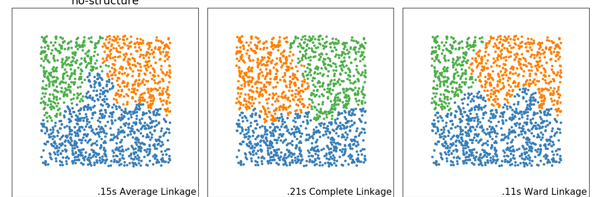

# Clustering Grids

This small tutorial will show how to use Gridtest to generate grids to run the
[scikit-learn](https://scikit-learn.org/stable/auto_examples/cluster/plot_linkage_comparison.html#sphx-glr-auto-examples-cluster-plot-linkage-comparison-py) cluster plot linkage comparison.

## Developing the Grids

When you look at the original code, it's a bit "top to bottom" (yes I'm avoiding
calling it spaghetti code!) The first thing we want to do is think about how
we would turn this into neater functions, and further, have those functions
easy to plug into a grid. 

### Dataset Generation

The first section is easy - we see a bunch of datasets being produced, and then we want to run those
datasets across a set of models. This is perfect! We can write a `generate_datasets`
function that will take in some input parameters and be used to generate a 
grid. Here is what that looks like - this was largely adding intendation
to the already existing code.

```python
def generate_datasets(n_samples=1500, factor=0.5, noise=0.05):
    """This generate_datasets function is simply taking the original 
       (top to bottom) style code, and converting into a function to
       return datasets. This function can be provided to a grid, and then
       each dataset will be run across some number of variables to produce
       a grid
    """
    noisy_circles = datasets.make_circles(n_samples=n_samples, factor=factor,
                                          noise=noise)
    noisy_moons = datasets.make_moons(n_samples=n_samples, noise=.05)
    blobs = datasets.make_blobs(n_samples=n_samples, random_state=8)
    no_structure = np.random.rand(n_samples, 2), None

    # Anisotropicly distributed data
    random_state = 170
    X, y = datasets.make_blobs(n_samples=n_samples, random_state=random_state)
    transformation = [[0.6, -0.6], [-0.4, 0.8]]
    X_aniso = np.dot(X, transformation)
    aniso = (X_aniso, y)

    # blobs with varied variances
    varied = datasets.make_blobs(n_samples=n_samples,
                                 cluster_std=[1.0, 2.5, 0.5],
                                 random_state=random_state)

    return [
        (noisy_circles, {'n_clusters': 2}),
        (noisy_moons, {'n_clusters': 2}),
        (varied, {'n_neighbors': 2}),
        (aniso, {'n_neighbors': 2}),
        (blobs, {}),
        (no_structure, {})]
```

At this point we have enough for a very simple grid. Let's write that now:

```yaml
analysis:
  grids:
    generate_datasets:
      functions:
        datasets: analysis.generate_datasets
```

In the above, we've created a grid called `generate_datasets`. We have 
define one variables that is generated by the function `analysis.generate_datasets`.
From the above we can see this function produces a list of datasets, and this list
will be piped into the dataset variable. We can check this:

```bash
gridtest gridview grids.yml generate_datasets --count
1 argument sets produced.
```
```bash
$ gridtest gridview grids.yml generate_datasets                                                                                                                      
{'datasets': [((array([[-0.67799938, -0.69875698],
       [ 0.93143746,  0.19139133],
       [ 0.54829131, -0.00601715],
       ...,
       [-0.34518816, -0.35804797],
       [ 0.01719727, -0.94513802],
       [ 0.91377877, -0.59884164]]), array([0, 0, 1, ..., 1, 0, 0])), {'n_clusters': 2}), ((array([[ 0.49627131, -0.34275349],
       [-0.16629956,  0.92234209],
       [ 0.71895601,  0.66529038],
       ...,
       [ 1.90950927,  0.02989686],
       [ 0.54623069, -0.36003133],
       [ 0.04090016,  0.37069297]]), array([1, 0, 0, ..., 1, 1, 1])), {'n_clusters': 2}), ((array([[ -6.11119721,   1.47153062],
       [ -7.49665361,   0.9134251 ],
       [-10.84489837,  -7.55352273],
       ...,
       [  1.64990343,  -0.20117787],
       [  0.79230661,   0.60868888],
       [  1.91226342,   0.25327399]]), array([1, 1, 0, ..., 2, 2, 2])), {'n_neighbors': 2}), ((array([[-3.37561542,  3.63236314],
       [-3.61882807,  3.78627892],
       [-3.48552993,  0.46412084],
       ...,
       [ 1.17962827, -1.54262502],
       [-0.49738132,  0.78227797],
       [ 1.13089877, -1.13033403]]), array([1, 1, 0, ..., 2, 2, 2])), {'n_neighbors': 2}), ((array([[ 5.86749807,  8.17715188],
       [ 5.61369982,  9.93295527],
       [ 7.22508428, 10.44886194],
       ...,
       [ 7.73674097, 10.82855388],
       [-4.61701094, -9.64855983],
       [-3.48640175, -9.25766922]]), array([0, 0, 0, ..., 0, 2, 2])), {}), ((array([[0.59945663, 0.24694133],
       [0.5173267 , 0.57255303],
       [0.55229185, 0.40567924],
       ...,
       [0.8384347 , 0.52906874],
       [0.84228843, 0.11517496],
       [0.91963613, 0.22592146]]), None), {})]}
```

But actually, we would want to unwrap this list so that each of the datasets
can be parsed by some other function. Let's do that now by adding "unwrap" set
to true to our grid:


```yaml
analysis:
  grids:
    generate_datasets:
      functions:
        datasets:
           func: analysis.generate_datasets
           unwrap: true
```

Do we generate 6 separate datasets?

```bash
$ gridtest gridview grids.yml generate_datasets
{'datasets': ((array([[-0.67799938, -0.69875698],
       [ 0.93143746,  0.19139133],
       [ 0.54829131, -0.00601715],
       ...,
       [-0.34518816, -0.35804797],
       [ 0.01719727, -0.94513802],
       [ 0.91377877, -0.59884164]]), array([0, 0, 1, ..., 1, 0, 0])), {'n_clusters': 2})}
{'datasets': ((array([[ 0.49627131, -0.34275349],
       [-0.16629956,  0.92234209],
       [ 0.71895601,  0.66529038],
       ...,
       [ 1.90950927,  0.02989686],
       [ 0.54623069, -0.36003133],
       [ 0.04090016,  0.37069297]]), array([1, 0, 0, ..., 1, 1, 1])), {'n_clusters': 2})}
{'datasets': ((array([[ -6.11119721,   1.47153062],
       [ -7.49665361,   0.9134251 ],
       [-10.84489837,  -7.55352273],
       ...,
       [  1.64990343,  -0.20117787],
       [  0.79230661,   0.60868888],
       [  1.91226342,   0.25327399]]), array([1, 1, 0, ..., 2, 2, 2])), {'n_neighbors': 2})}
{'datasets': ((array([[-3.37561542,  3.63236314],
       [-3.61882807,  3.78627892],
       [-3.48552993,  0.46412084],
       ...,
       [ 1.17962827, -1.54262502],
       [-0.49738132,  0.78227797],
       [ 1.13089877, -1.13033403]]), array([1, 1, 0, ..., 2, 2, 2])), {'n_neighbors': 2})}
{'datasets': ((array([[ 5.86749807,  8.17715188],
       [ 5.61369982,  9.93295527],
       [ 7.22508428, 10.44886194],
       ...,
       [ 7.73674097, 10.82855388],
       [-4.61701094, -9.64855983],
       [-3.48640175, -9.25766922]]), array([0, 0, 0, ..., 0, 2, 2])), {})}
{'datasets': ((array([[0.59945663, 0.24694133],
       [0.5173267 , 0.57255303],
       [0.55229185, 0.40567924],
       ...,
       [0.8384347 , 0.52906874],
       [0.84228843, 0.11517496],
       [0.91963613, 0.22592146]]), None), {})}
```
```bash
gridtest gridview grids.yml generate_datasets --count
6 argument sets produced.
```

If we wanted to add a variable for each generation of a dataset,
we would add it under args. As an example, let's add a variable `n_samples`
to vary the number of samples. Let's say we want to do each of 1500 and
3000. We can add an arg that will be added to the parameterization:

```python
analysis:
  grids:

    generate_datasets:
      args:
        n_samples: [1500, 3000]
      functions:
        dataset:
          func: analysis.generate_datasets
          unwrap: true
        algorithms: analysis.generate_algorithms
```

If this works as expected, we would want 6 datasets (the result of unwrap) x2 (one
for each of the number of samples (12). We can ask explicitly to see the variable "dataset"
with `--arg` (truncated for readability):

```bash
gridtest gridview grids.yml generate_datasets --arg datasets
[((array([[-0.67799938, -0.69875698],
       [ 0.93143746,  0.19139133],
       [ 0.54829131, -0.00601715],
       ...,
       [-0.34518816, -0.35804797],
       [ 0.01719727, -0.94513802],
       [ 0.91377877, -0.59884164]]), array([0, 0, 1, ..., 1, 0, 0])), {'n_clusters': 2}), ((array([[ 0.49627131, -0.34275349],
       [-0.16629956,  0.92234209],
       [ 0.71895601,  0.66529038],
       ...,
       ...
       ...,
       [0.07990429, 0.71819444],
       [0.38310211, 0.44144583],
       [0.75244099, 0.22064084]]), None), {})]

```
```bash
$ gridtest gridview grids.yml generate_datasets --arg datasets --count
Variable datasets has length 12.
```

We won't use this for this simple example, but will add additional args 
later in this example. Let's start with our original 6 datasets, and
generate algorithms for each.

### Algorithm Generation

The algorithms are generated from the datasets, and we can again write a simple
function to do this:

We naturally want to do the same thing for the set of algorithms that are looped
over. In this case, each algorithm takes a dataset as input.

```python
def get_algorithms(dataset):
    """this was previously in the nested for loop, and returns a tuple of
       algorithms. Since params is derived from a dataset (the index 1) we
       take a dataset as input and then grab the params from it.
    """
    params = dataset[1]
    ward = cluster.AgglomerativeClustering(
        n_clusters=params['n_clusters'], linkage='ward')
    complete = cluster.AgglomerativeClustering(
        n_clusters=params['n_clusters'], linkage='complete')
    average = cluster.AgglomerativeClustering(
        n_clusters=params['n_clusters'], linkage='average')

    return (
        ('Average Linkage', average),
        ('Complete Linkage', complete),
        ('Ward Linkage', ward),
    )
```

The design is really up to you - in this case I chose to pair each dataset
with generation of 3 algorithms since the original code was modeled in that
form. However you could also have each algorithm generation be a separate function.
Let's add a grid that will run this algorithm for each dataset. What set of
datasets? Let's just make a reference to the 6 datasets that we just made.

```yaml
    generate_algorithms:
      ref:
        dataset: generate_datasets.datasets
      functions:
        algorithms: analysis.generate_algorithms
```

And we would expect the 6 datasets to be run through the function once,
generating 6 items, each with algorithms added:

```bash
$ gridtest gridview grids.yml generate_algorithms 
{'dataset': ('blobs', (array([[ 8.26573117,  0.56159687],
       [ 8.70688264, 10.68949521],
       [ 9.32813486,  0.17474761],
       ...,
       [ 8.33646324,  0.0705084 ],
       [ 7.16968586,  8.66745049],
       [ 8.01727721,  0.21072996]]), array([1, 0, 1, ..., 1, 0, 1])), {}), 'algorithms': [('Average Linkage', AgglomerativeClustering(affinity='euclidean', compute_full_tree='auto',
            connectivity=None, linkage='average', memory=None,
            n_clusters=3, pooling_func=<function mean at 0x7f049be74cb0>)), ('Complete Linkage', AgglomerativeClustering(affinity='euclidean', compute_full_tree='auto',
            connectivity=None, linkage='complete', memory=None,
            n_clusters=3, pooling_func=<function mean at 0x7f049be74cb0>)), ('Ward Linkage', AgglomerativeClustering(affinity='euclidean', compute_full_tree='auto',
            connectivity=None, linkage='ward', memory=None, n_clusters=3,
            pooling_func=<function mean at 0x7f049be74cb0>))]}
{'dataset': ('no-structure', (array([[0.25114494, 0.74550472],
       [0.40554956, 0.34608139],
       [0.72326419, 0.8238374 ],
       ...,
       [0.07990429, 0.71819444],
       [0.38310211, 0.44144583],
       [0.75244099, 0.22064084]]), None), {}), 'algorithms': [('Average Linkage', AgglomerativeClustering(affinity='euclidean', compute_full_tree='auto',
            connectivity=None, linkage='average', memory=None,
            n_clusters=3, pooling_func=<function mean at 0x7f049be74cb0>)), ('Complete Linkage', AgglomerativeClustering(affinity='euclidean', compute_full_tree='auto',
            connectivity=None, linkage='complete', memory=None,
            n_clusters=3, pooling_func=<function mean at 0x7f049be74cb0>)), ('Ward Linkage', AgglomerativeClustering(affinity='euclidean', compute_full_tree='auto',
            connectivity=None, linkage='ward', memory=None, n_clusters=3,
            pooling_func=<function mean at 0x7f049be74cb0>))]}
       ...
```

The count is 6 as we expect.

```bash
$ gridtest gridview grids.yml generate_algorithms --count
6 argument sets produced.
```

### Test Generation

We need our final function that takes in two arguments, a dataset and a list
of algorithms, and generates an output image. The function is basically
the rest of th eoriginal script wrapped in a function, and the test in the
file looks like this:

```yaml
  tests:
    analysis.generate_plots:
      - grid: generate_algorithms
```

In the above, we tell the `analysis.generate_plots` function that takes
as input a dataset and set of algorithms to use the grid `generate_algorithms`
which has parameter grids with each of `dataset` and `algorithms` defined.
We can then run tests, and see an output png generated for each dataset,
across all algorithms.

```
gridtest test grids.yml                                                                                                 
[6/6] |===================================| 100.0% 
Name                           Status                         Summary                       
________________________________________________________________________________________________________________________
analysis.generate_plots.0      success                                                      
analysis.generate_plots.1      success                                                      
analysis.generate_plots.2      success                                                      
analysis.generate_plots.3      success                                                      
analysis.generate_plots.4      success                                                      
analysis.generate_plots.5      success                                                      
```

Here is an example!



And our final grids.yml looks like this:

```yaml
analysis:
  grids:
   
    generate_datasets:
      functions:
        datasets:
           func: analysis.generate_datasets
           unwrap: true

    generate_algorithms:
      ref:
        dataset: generate_datasets.datasets
      functions:
        algorithms: analysis.generate_algorithms
        
  tests:
    analysis.generate_plots:
      - grid: generate_algorithms
```

But the goal of gridtest would be to make these runs modular, meaning that we
could record metrics for each dataset and each algorithm. The example
here served to show a simple thought process to go from a single
top to bottom script to a simple grid. The [next example](../2-modular-grids) will take this a step
further to make it optimized in terms of modularity.
