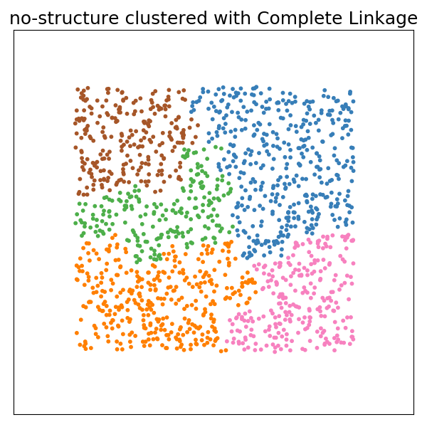

# Modular Clustering Grids

We are starting with the [1-dataset-algorithms-grids](../1-dataset-algorithms-grids)
example and modifying it to be completely modular - meaning that the algorithms
and datasets are completely separated, and the the logic looks like this:

```
for every dataset and parameter combination
    for every algorithm and parameter combination
       generate a plot along with metrics
```

The idea would be that each grid in our [grids.yml](grids.yml) is modular, so
I might use either analysis or dataset for another analysis, or write
different tests that manipulate the grids. Let's start with updating our
functions.

## Updating the Grids

### Algorithm Generation

Let's start with the function to generate algorithms. If you remember from
the previous example, the function took in a dataset as a dependency. But
now we want to eliminate that, so we will instead input just the number of clusters.

```bash
def generate_algorithms(n_clusters=2):
    """Here we have updated the original generate_algorithms function to separate
       the dataset from it, so it can be run in parallel, and the number of clusters
       variable varied.
    """
    ward = cluster.AgglomerativeClustering(
        n_clusters=n_clusters, linkage='ward')
    complete = cluster.AgglomerativeClustering(
        n_clusters=n_clusters, linkage='complete')
    average = cluster.AgglomerativeClustering(
        n_clusters=n_clusters, linkage='average')

    return [
        ('Average Linkage', average),
        ('Complete Linkage', complete),
        ('Ward Linkage', ward),
    ]
```

And then we can vary the parameter for the number of clusters. The following says to
run the function for value of n_clusters, and then "unwrap" the result. This should
mean that the variable "algorithms" is a list of 3 algorithms x 2 args, for a total of
6:

```bash
$ gridtest gridview grids.yml generate_algorithms --arg algorithms
[('Average Linkage', AgglomerativeClustering(affinity='euclidean', compute_full_tree='auto',
            connectivity=None, linkage='average', memory=None,
            n_clusters=2, pooling_func=<function mean at 0x7f3705f50cb0>)), ('Complete Linkage', AgglomerativeClustering(affinity='euclidean', compute_full_tree='auto',
            connectivity=None, linkage='complete', memory=None,
            n_clusters=2, pooling_func=<function mean at 0x7f3705f50cb0>)), ('Ward Linkage', AgglomerativeClustering(affinity='euclidean', compute_full_tree='auto',
            connectivity=None, linkage='ward', memory=None, n_clusters=2,
            pooling_func=<function mean at 0x7f3705f50cb0>)), ('Average Linkage', AgglomerativeClustering(affinity='euclidean', compute_full_tree='auto',
            connectivity=None, linkage='average', memory=None,
            n_clusters=5, pooling_func=<function mean at 0x7f3705f50cb0>)), ('Complete Linkage', AgglomerativeClustering(affinity='euclidean', compute_full_tree='auto',
            connectivity=None, linkage='complete', memory=None,
            n_clusters=5, pooling_func=<function mean at 0x7f3705f50cb0>)), ('Ward Linkage', AgglomerativeClustering(affinity='euclidean', compute_full_tree='auto',
            connectivity=None, linkage='ward', memory=None, n_clusters=5,
            pooling_func=<function mean at 0x7f3705f50cb0>))]
```
```bash
$ gridtest gridview grids.yml generate_algorithms --arg algorithms --count
Variable algorithms has length 6.
```

Great! Now let's review our datasets.

### Dataset Generation

We actually don't need to update the datasets grid, because it already generates
a list of datasets that we can use. As a reminder, here is the grid definition,
which also uses unwrap for the variable:

```yaml
    generate_datasets:
      functions:
        datasets:
           func: analysis.generate_datasets
           unwrap: true
```

And we can confirm that 6 are generated:

```bash
$ gridtest gridview grids.yml generate_datasets --arg datasets --count
Variable datasets has length 6.
```

However we will remove the n_clusters (and params provided with the dataset)
since they aren't used anymore. The new function just returns the dataset
with it's name. The list of tuples will be unwrapped so each dataset is treated
as a single unit in the parameterization.

```python
def generate_datasets(n_samples=1500, factor=0.5, noise=0.05):
    """This generate_datasets function is simply taking the original 
       (top to bottom) style code, and converting into a function to
       return datasets. This function can be provided to a grid, and then
       each dataset will be run across some number of variables to produce
       a grid
    """
    noisy_circles = datasets.make_circles(n_samples=n_samples, factor=factor,
                                          noise=noise)
    noisy_moons = datasets.make_moons(n_samples=n_samples, noise=.05)
    blobs = datasets.make_blobs(n_samples=n_samples, random_state=8)
    no_structure = np.random.rand(n_samples, 2), None

    # Anisotropicly distributed data
    random_state = 170
    X, y = datasets.make_blobs(n_samples=n_samples, random_state=random_state)
    transformation = [[0.6, -0.6], [-0.4, 0.8]]
    X_aniso = np.dot(X, transformation)
    aniso = (X_aniso, y)

    # blobs with varied variances
    varied = datasets.make_blobs(n_samples=n_samples,
                                 cluster_std=[1.0, 2.5, 0.5],
                                 random_state=random_state)

    # name, dataset
    return [
        ("circles", noisy_circles),
        ("moons", noisy_moons),
        ("varied", varied),
        ("aniso", aniso),
        ("blobs", blobs),
        ("no-structure", no_structure)]
```

### Plot Generation

We are almost done! We now want to run a test that will iterate over the list
of algorithms, datasets, and any additional arguments that we provide. First
we can make a grid to parameterize the two:

```yaml
    generate_inputs:
      ref:
        algorithm: generate_algorithms.algorithms
        dataset: generate_datasets.datasets
```


Since we know the list of algorithms produces 6 (3 algorithms over 2 cluster sizes)
and there are 6 datasets, we should have a total of 36 in the parameterized result:

```bash
$ gridtest gridview grids.yml generate_inputs --count
36 argument sets produced.
```

And we do! Now we can update the analysis.generate_plot function (note I've
renamed it from generate_plots to generate_plot since we are just running
one dataset for one algorithm now!) It just points to the `generate_inputs` grid - and we updated this from
previously when it pointed to the generate_algorithms grid, since we had not
separated out the algorithms.

```yaml
    # To be used in this test.
    analysis.generate_plot:
      - grid: generate_inputs
```

### Testing the Test

Let's run the test! Actually, first let's run an interactive test so we can see
the arguments being handed to the function, and debug or develop if necessary:

```bash
$ gridtest test grids.yml --interactive
[analysis.generate_plot:1/36] ||----------------------------------|   2.8% 

Gridtest interactive mode! Press Control+D to cycle to next test.

Variables
   func: <function generate_plot at 0x7f5e3dbc6b00>
 module: analysis
   args: {'algorithm': ('Average Linkage', AgglomerativeClustering(affinity='euclidean', compute_full_tree='auto',
            connectivity=None, linkage='average', memory=None,
            n_clusters=2, pooling_func=<function mean at 0x7f5e4c047cb0>)), 'dataset': ('circles', (array([[-0.67799938, -0.69875698],
       [ 0.93143746,  0.19139133],
       [ 0.54829131, -0.00601715],
       ...,
       [-0.34518816, -0.35804797],
       [ 0.01719727, -0.94513802],
       [ 0.91377877, -0.59884164]]), array([0, 0, 1, ..., 1, 0, 0])), {'n_clusters': 2})}
returns: None

How to test
passed, error = test_types(func, args, returns)
result = func(**args)

Python 3.7.4 (default, Aug 13 2019, 20:35:49) 
Type 'copyright', 'credits' or 'license' for more information
IPython 7.8.0 -- An enhanced Interactive Python. Type '?' for help.
```

The args look as we expect, a dictionary (key word arguments or kwargs) that
will be exploded into the function, which we also see 

```bash
Variables
   func: <function generate_plot at 0x7f5e3dbc6b00>
```

We can see `How to test` in the terminal as well, and quit with Control+D when we finish.

### Running the Test

```bash
$ gridtest test grids.yml
$ gridtest test grids.yml
[36/36] |===================================| 100.0% 
Name                           Status                         Summary                       
________________________________________________________________________________________________________________________
analysis.generate_plot.0       success                                                      
analysis.generate_plot.1       success                                                      
analysis.generate_plot.2       success                                                      
analysis.generate_plot.3       success                                                      
analysis.generate_plot.4       success                                                      
analysis.generate_plot.5       success                                                      
analysis.generate_plot.6       success                                                      
analysis.generate_plot.7       success                                                      
analysis.generate_plot.8       success                                                      
analysis.generate_plot.9       success                                                      
analysis.generate_plot.10      success                                                      
analysis.generate_plot.11      success                                                      
analysis.generate_plot.12      success                                                      
analysis.generate_plot.13      success                                                      
analysis.generate_plot.14      success                                                      
analysis.generate_plot.15      success                                                      
analysis.generate_plot.16      success                                                      
analysis.generate_plot.17      success                                                      
analysis.generate_plot.18      success                                                      
analysis.generate_plot.19      success                                                      
analysis.generate_plot.20      success                                                      
analysis.generate_plot.21      success                                                      
analysis.generate_plot.22      success                                                      
analysis.generate_plot.23      success                                                      
analysis.generate_plot.24      success                                                      
analysis.generate_plot.25      success                                                      
analysis.generate_plot.26      success                                                      
analysis.generate_plot.27      success                                                      
analysis.generate_plot.28      success                                                      
analysis.generate_plot.29      success                                                      
analysis.generate_plot.30      success                                                      
analysis.generate_plot.31      success                                                      
analysis.generate_plot.32      success
analysis.generate_plot.33      success                                                      
analysis.generate_plot.34      success                                                      
analysis.generate_plot.35      success                                                      
```

The images generated are shown in the present working directory here. Here is one example:



### Adding Metrics

This is where it gets a little more interesting! We can add [metrics](https://vsoch.github.io/gridtest/getting-started/metrics/) to compare across the runs. As an easy example, let's time each run - the @timeit function
is provded by gridtest. 


If you write your own metric or want to use one (a decorator) that already exists, you can
just reference it as the importable path.

```yaml
    # To be used in this test.
    analysis.generate_plot:
      - grid: generate_inputs
        metrics: ["@timeit"]
```

And we now get a time for each algorithm and dataset generation:

```bash
$ gridtest test grids.yml[36/36] |===================================| 100.0% 
Name                           Status                         Summary                       
________________________________________________________________________________________________________________________
analysis.generate_plot.0       success                                                      
analysis.generate_plot.1       success                                                      
analysis.generate_plot.2       success                                                      
analysis.generate_plot.3       success                                                      
analysis.generate_plot.4       success                                                      
analysis.generate_plot.5       success                                                      
analysis.generate_plot.6       success                                                      
analysis.generate_plot.7       success                                                      
analysis.generate_plot.8       success                                                      
analysis.generate_plot.9       success                                                      
analysis.generate_plot.10      success                                                      
analysis.generate_plot.11      success                                                      
analysis.generate_plot.12      success                                                      
analysis.generate_plot.13      success                                                      
analysis.generate_plot.14      success                                                      
analysis.generate_plot.15      success                                                      
analysis.generate_plot.16      success                                                      
analysis.generate_plot.17      success                                                      
analysis.generate_plot.18      success                                                      
analysis.generate_plot.19      success                                                      
analysis.generate_plot.20      success                                                      
analysis.generate_plot.21      success                                                      
analysis.generate_plot.22      success                                                      
analysis.generate_plot.23      success                                                      
analysis.generate_plot.24      success                                                      
analysis.generate_plot.25      success                                                      
analysis.generate_plot.26      success                                                      
analysis.generate_plot.27      success                                                      
analysis.generate_plot.28      success                                                      
analysis.generate_plot.29      success                                                      
analysis.generate_plot.30      success                                                      
analysis.generate_plot.31      success                                                      
analysis.generate_plot.32      success                                                      
analysis.generate_plot.33      success                                                      
analysis.generate_plot.34      success                                                      
analysis.generate_plot.35      success                                                      

________________________________________________________________________________________________________________________
analysis.generate_plot.0       @timeit                        4836.47 ms                    
analysis.generate_plot.1       @timeit                        4832.80 ms                    
analysis.generate_plot.2       @timeit                        3736.94 ms                    
analysis.generate_plot.3       @timeit                        4345.53 ms                    
analysis.generate_plot.4       @timeit                        4861.36 ms                    
analysis.generate_plot.5       @timeit                        3906.09 ms                    
analysis.generate_plot.6       @timeit                        4704.65 ms                    
analysis.generate_plot.7       @timeit                        5144.60 ms                    
analysis.generate_plot.8       @timeit                        4780.60 ms                    
analysis.generate_plot.9       @timeit                        4818.56 ms                    
analysis.generate_plot.10      @timeit                        4808.86 ms                    
analysis.generate_plot.11      @timeit                        5685.36 ms                    
analysis.generate_plot.12      @timeit                        4822.39 ms                    
analysis.generate_plot.13      @timeit                        5762.99 ms                    
analysis.generate_plot.14      @timeit                        5397.26 ms                    
analysis.generate_plot.15      @timeit                        5839.27 ms                    
analysis.generate_plot.16      @timeit                        5394.22 ms                    
analysis.generate_plot.17      @timeit                        2114.58 ms                    
analysis.generate_plot.18      @timeit                        1972.74 ms                    
analysis.generate_plot.19      @timeit                        1901.97 ms                    
analysis.generate_plot.20      @timeit                        1706.98 ms                    
analysis.generate_plot.21      @timeit                        2070.13 ms                    
analysis.generate_plot.22      @timeit                        2010.58 ms                    
analysis.generate_plot.23      @timeit                        2021.10 ms                    
analysis.generate_plot.24      @timeit                        1966.76 ms                    
analysis.generate_plot.25      @timeit                        1980.24 ms                    
analysis.generate_plot.26      @timeit                        2005.79 ms                    
analysis.generate_plot.27      @timeit                        1383.97 ms                    
analysis.generate_plot.28      @timeit                        1851.91 ms                    
analysis.generate_plot.29      @timeit                        1732.63 ms                    
analysis.generate_plot.30      @timeit                        1798.06 ms                    
analysis.generate_plot.31      @timeit                        1417.78 ms                    
analysis.generate_plot.32      @timeit                        1510.49 ms                    
analysis.generate_plot.33      @timeit                        1465.70 ms                    
analysis.generate_plot.34      @timeit                        1325.80 ms                    
analysis.generate_plot.35      @timeit                        1467.37 ms                    

36/36 tests passed
```

We then might just want to save metrics:

```bash
$ gridtest test grids.yml --save-metrics metrics.json
```

For the full results, most of the time json wouldn't be feasible, so you
can save to pickle:

```bash
$ gridtest test grids.yml --save results.pkl
```

### Summary

Now that we've made our grids modular, it would be very easy to use the datasets
OR the algorithms for another purpose. We could even read them into Python
for interactive use, or provide the grids.yml and script for others
to more easily develop other functions that use them.
