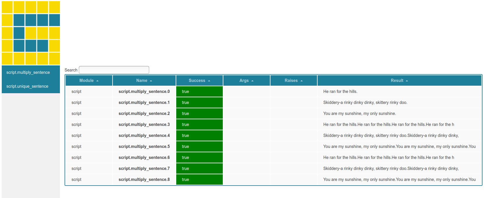

## Summary

Creating reproducible testing and parameterization is a consistent challenge
in research because it is hard to do [@Koteska2015ScientificST]. 
Researchers often don't have the bandwidth to think about tests, and
consequently, creating tools for this use case is often overlooked.
GridTest [@gridtest] is a library that specializes in generating parameter grids. The grids
are most obviously used for testing, but can extend to other use cases.
In the context of testing, GridTest makes it easy to discover functions,
classes, and arguments for Python scripts or modules, and then generate
a template to easily populate. Outside of testing, grids can be created
that are version controlled, programatically defined with functions,
and easy to interact with from the command line or Python interpreter.
Grids can be used with tests that can further be parameterized
and configured to collect metrics for each case run. Both grid and test 
specifications are stored in a simple YAML configuration that the library helps to generate,
and features include interactive debugging, interactive report generation,
and provided metrics (Python decorators) that can assist with research.

## Background

While several scientific libraries [@sklearn; @gridregular] make it possible to
generate parameter grids within code, they require a substantial list of
numerical library dependencies that might be overkill for the user's needs,
and further, they don't allow for representation of grids outside of the code.
Additionally, these libraries do not natively allow for interactive debugging,
collection of metrics around grids, or report generation. Another subset
of grid generation libraries are specifically intended for hyperparameter tuning
[@keras; @h2o; @Willkoehrsen2018-hm], and are thus packaged
alongside machine learning libraries. While these libraries are rich and hugely
useful for their intended purposes, none of them present a domain-agnostic,
simple grid definition that can be defined outside of the programming language (e.g., R, Python)
code that uses it. The landscape is missing a library that places grids alongside
code, and can define them without needing it. GridTest offers this ability,
and further, introduces a new paradigm that grids might be shared between
code bases as their own entity, and are not required to be embedded within it.

### Grids as First Class Citizens

Parameters always come as a second thought when writing tests, and this is
why they are commonly applied as decorators. The author of this software
realized that she might want to define just sets of parameters that expand
into matrices that can be useful across many use cases. This makes
the grids "first class citizens." For example, instead of a top to bottom
script that loops over some set of datasets, parameters, and algorithms, 
the user could define grids to generate each in a modular fashion. This
is explained in detail for the [clustering grids](https://github.com/vsoch/gridtest/tree/master/examples/clustering-grids) example derived from scikit-learn. As another example, the user might
just want to parameterize some set of inputs to randomly generate a cohort.
This example is detailed [in another tutorial here](https://vsoch.github.io/gridtest/tutorials/samplegrid/). The overall idea is simple. The current practice is generally to write parameterizations alongside code, whether that means nested for loops or decorators for testing.
GridTest allows for this same kind of functionality, but storing the parameterization
alongside the code and not embedded with it. This makes it easy to change grids
or tests without touching the code.

## Concepts

### Testing

A **gridtest**: is one that is run over a grid of parameter settings. Each test
can include a set of argument specifications, and optionally mapping these arguments
to functions so they can be programatically defined. 
A grid can be inline to the test (if not used elsewhere) or defined globally and shared.
For an example of command line usage, the reader is directed to the ["How does it work"](https://vsoch.github.io/gridtest/getting-started/index.html) section in the Getting Started guide.

### Parameterization

A **grid** is a global definition of a parameter matrix. A user can define arguments,
and optionally functions to run to be mapped to arguments. Grids are generated
on demand, meaning when the user iterates over a Grid object, so that no large lists are stored in memory.
Grids can be put to many uses. The user might share a repository that only defines grids that people
can use across many different kinds of machine learning models, possibly to collect metrics
and compare different analysis strategies being used. An introduction to grids
is available [here](https://vsoch.github.io/gridtest/getting-started/grids/).

### Metrics

A **metric** is a Python decorator that is paired with a test that will measure some
attribute of a test. For example:
 - the user might run a function across a grid of arguments, and then measure the time that each combination takes (the metric), and generate a report for inspection.
 - the user might be doing text processing and having functions to parse text. Each function might be run over a grid of sentences and counts, and for each result, the number of unique and total words is counted (metrics).

Metrics are fully described in the [metrics](https://vsoch.github.io/gridtest/getting-started/metrics/) section
of the documentation.

## Use Cases

GridTest has use cases well beyond testing, because parameterization is used
widely across data science, and version control for reproducibility of those
parameters is essential for reproducible, sustainable science. The following
set of examples are good use cases.

### 1. Parameter Grids

GridTest extends the traditional definition [@sklearn-tutorial] of a grid to include:

 - [generating random samples](https://vsoch.github.io/gridtest/tutorials/samplegrid/)
 - [loading grids via a GridRunner](https://vsoch.github.io/gridtest/getting-started/grids/index.html) class separate from the application's Python code.
 - generating grids as they are needed (meaning as an iterator)
 - previewing grids on the command line before using them
 - generating content of grids via external functions, and optionally unwrapping list values

Grids are generated on demand for more efficient memory allocation, and can be extended to any use case that requires some combination of arguments, and optionally functions to run to be mapped to arguments. See the section on the concept of a grid for more detail. 

### 2. Capturing Metrics

How long does a function take to run when provided parameter X as one value, versus
another? By way of allowing the user to specify one or more metrics alongside tests,
they can easily capture metrics (Python decorators to functions to test)
to output in an interactive report. For example, if the user writes a test that runs
a machine learning algorithm across a grid of datasets and algorithms, they can easily
add a metric to record the time that each takes, and save this result to a file.
GridTest provides a standard set of [decorators](https://vsoch.github.io/gridtest/tutorials/decorators/index.html) for
ease of use, and the user is also free to write their own functions to collect
metrics.

### 3. Generating Reports

It can be handy to save results to a data file (e.g., results.json) or generate
an interactive report for GitHub pages. GridTest allows for this by way of the
`--save` or `--save-web` flags. An example web report is shown in Figure 1. Any grid can also be exported
to JSON for archiving in a repository or extension to other custom visualizations.

An interactive, live report is available to view [here](https://vsoch.github.io/gridtest/templates/report/),
and more information about reports and export formats is provided [here](https://vsoch.github.io/gridtest/getting-started/results/index.html). More domain-specific reports can be developed as requested.

### 4. Debugging

What programmer hasn't been in the scenario of running a group of tests,
and then having some fail? What can be done? The user might start an interactive
shell, import what is needed, and try to reproduce, or they can turn up verbosity
and add a bunch of print statements to figure out what is going on. GridTest makes
this much easier with it's `--interactive` mode, which allows the user to 
shell into an interactive session right before the function is run to allow for debugging. 
A detailed walkthrough of debugging is provided [here](https://vsoch.github.io/gridtest/getting-started/debugging/).

### 5. Running Reproducible Tests

When the user writes tests for a file, local, or system module, they store them in
a YAML file that is stored alongside the code, and can be tested with CI.
The YAML file can have grids of parameters defined so the user can easily test many
different combinations.

### 6. Knowing the tests to write

Whether tests are written during development or at the end of it, the user typically needs to look through files
to know the function names and arguments that need to be tested. GridTest solves
this problem by way of discovery - the user can give it a module name, a file name, or
an entire directory with Python files, and it will generate a template
to fill in that already includes arguments and functions.  
Once tests are written, the user can run GridTest with the `--check` feature
to find newly added functions in the code. For more details about creating, checking, and updating
tests, see the [testing](https://vsoch.github.io/gridtest/getting-started/testing/index.html)
documentation.

In summary, GridTest:

 1. Lets the user define grids to be generated programatically, version controlled, and used for multiple purposes
 2. Allows measuring metrics alongside tests
 3. Stores tests in a YAML file that can be stored in version control
 4. Generates data exports and interactive reports for results
 5. Provides an easy way to interactively debug
 6. Helps to discover the tests that need to be written, and creates a template to fill in
 7. Makes it easy to define and interact with expanded parameter grids

## Conclusion

GridTest aims to be a general tool for data scientists and research software engineers
alike. If there is a need to create a collection of grids, regardless of being used
for testing or another use case, GridTest can solve this problem. By way of saving
to YAML, GridTest can represent grids separately from code.
By way of providing JSON export with interactive web
reports, GridTest can be used in a continuous integration setup to generate a report
for some tests or metrics of interest. The author had amazing fun creating this library,
and is excited for its potential generalizability to support many different kinds
of research tasks. For more examples, tutorials, and details, see the official documentation at https://vsoch.github.io/gridtest [@gridtest-docs].

# References
